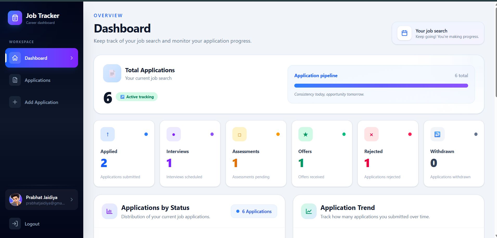
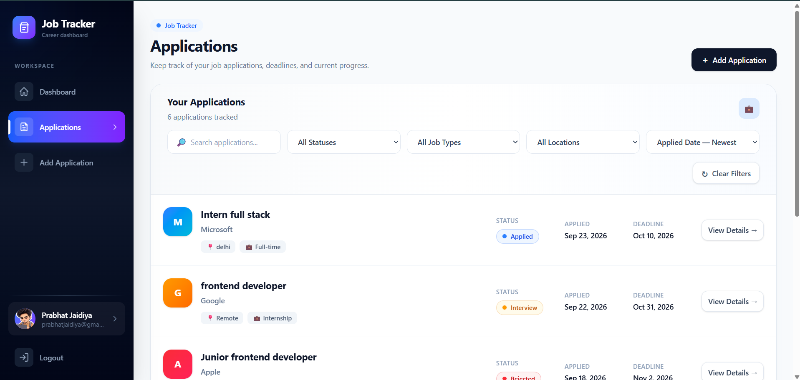
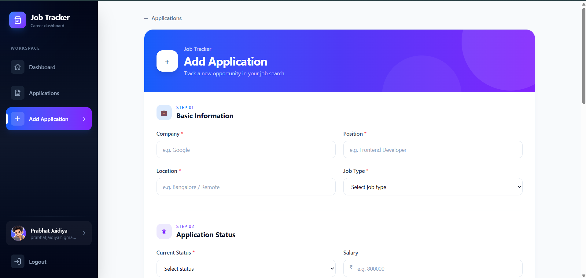
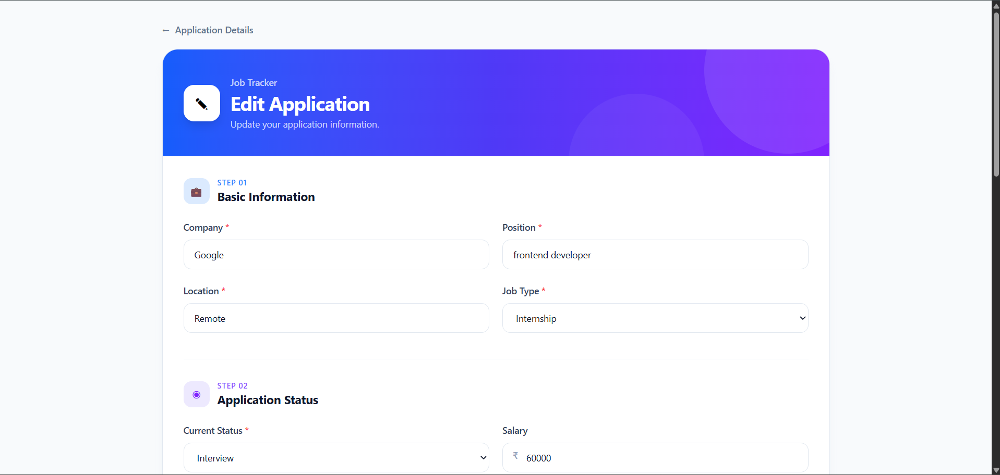
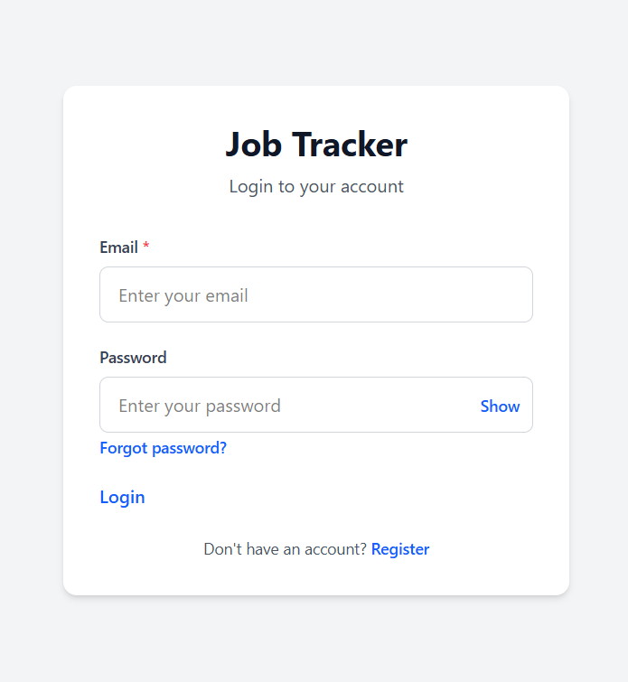

# 🚀 Job Tracker

A full-stack web application to organize, manage, and track job and internship applications in one place.

[Live Demo](https://job-tracker-frontend-26wf.onrender.com) · [Backend API](https://job-tracker-fbb2.onrender.com)

---

## 📌 About the Project

Job Tracker is a full-stack web application built to help students, freshers, and job seekers manage their job and internship applications efficiently.

When applying to multiple companies, keeping track of application statuses, deadlines, job details, and notes can become difficult. Job Tracker provides a centralized platform to organize this information and monitor application progress.

This project demonstrates my experience building and deploying a full-stack application using React, Node.js, Express, TypeScript, and MongoDB.

---

## ✨ Features

- 🔐 **User Authentication** — Register and log in securely.
- 📊 **Dashboard** — Access your job application management interface.
- 💼 **Application Management** — Create, view, update, and delete job application records.
- 📋 **Application Tracking** — Keep track of application statuses.
- 📅 **Date Management** — Record application dates and deadlines.
- 📝 **Job Details & Notes** — Organize company information, job details, and notes.
- 🔒 **Protected Routes** — Restrict access to authenticated areas.
- 👤 **User-Specific Data** — Associate applications with their respective users.
- 🌐 **Live Deployment** — Access the deployed application online.

---

## 🛠️ Tech Stack

### Frontend
- React
- Vite
- Tailwind CSS
- React Router

### Backend
- Node.js
- Express.js
- TypeScript
- REST API

### Database
- MongoDB
- Mongoose

### Authentication & Security
- JSON Web Tokens (JWT)
- bcrypt
- Environment variables

### Deployment & Version Control
- Render
- Git
- GitHub

---

## 🖥️ Live Demo

| Service | Link |
|---|---|
| Frontend | [Open Job Tracker](https://job-tracker-frontend-26wf.onrender.com) |
| Backend | [Backend Service](https://job-tracker-fbb2.onrender.com) |
| Health Check | [API Health Endpoint](https://job-tracker-fbb2.onrender.com/api/health) |

> The backend health endpoint is available for checking the API service. Application functionality may depend on the backend and database being available.

---

## 📸 Screenshots

Screenshots of the actual application will be added here.

Save your screenshots in a `screenshots/` directory in the repository.

### Dashboard



### Applications



### Add Application



### Edit Application



### Login Page



> Replace these image paths with your actual screenshot filenames if they differ.

---

## 📂 Project Structure

The project contains separate frontend and backend applications.

```text
job-tracker/
│
├── client/                  # React frontend
│   ├── src/
│   │   ├── components/
│   │   ├── pages/
│   │   ├── context/
│   │   └── ...
│   └── package.json
│
├── server/                  # Express backend
│   ├── src/
│   │   ├── models/
│   │   ├── routes/
│   │   ├── middleware/
│   │   └── ...
│   └── package.json
│
├── screenshots/             # Project screenshots
├── .gitignore
└── README.md
```

> Adjust the directory names to match your actual repository structure before publishing.

---

## ⚙️ Getting Started

Follow these instructions to run the project locally.

### Prerequisites

Make sure you have installed:

- [Node.js](https://nodejs.org/)
- npm
- [Git](https://git-scm.com/)
- A MongoDB database, such as [MongoDB Atlas](https://www.mongodb.com/atlas)

### 1. Clone the Repository

```bash
git clone https://github.com/prabhatjaidiya/job-tracker
```

Navigate into the project directory:

```bash
cd job-tracker
```

### 2. Set Up the Backend

```bash
cd server
npm install
```

Create a `.env` file inside the `server` directory.

Add the required environment variables:

```env
PORT=5000
MONGODB_URI=your_mongodb_connection_string
JWT_SECRET=your_long_random_secret
```

> Use the actual environment variable names expected by your backend. Do not commit your real `.env` file or secrets to GitHub.

Start the backend:

```bash
npm run dev
```

If your backend uses a different development script, use the script defined in `server/package.json`.

### 3. Set Up the Frontend

Open a new terminal:

```bash
cd client
npm install
```

Create a `.env` file inside the `client` directory.

```env
VITE_API_URL=http://localhost:5000
```

> Replace `VITE_API_URL` with the actual variable name used by your frontend if it differs.

Start the frontend:

```bash
npm run dev
```

Open the local URL shown in your terminal, usually:

```text
http://localhost:5173
```

---

## 🔑 Environment Variables

Configure these variables locally and in your deployment environment.

### Backend

| Variable | Description |
|---|---|
| `PORT` | Port used by the backend server |
| `MONGODB_URI` | MongoDB connection string |
| `JWT_SECRET` | Secret used to sign and verify JWTs |

### Frontend

| Variable | Description |
|---|---|
| `VITE_API_URL` | Backend API base URL |

**Important:** These are example names based on a typical setup. Verify them against your actual source code and deployment settings before using this section as exact configuration documentation.

Never publish database credentials, JWT secrets, API keys, or real user tokens.

---

## 🔌 API Endpoints

The backend exposes REST API routes for authentication and job application management.

### Health

| Method | Endpoint | Description |
|---|---|---|
| GET | `/api/health` | Check backend health |

### Authentication

| Method | Endpoint | Description |
|---|---|---|
| POST | `/api/auth/register` | Register a new user |
| POST | `/api/auth/login` | Log in a user |
| GET | `/api/auth/me` | Retrieve the authenticated user's information |

### Job Applications

| Method | Endpoint | Description |
|---|---|---|
| GET | `/api/applications` | Retrieve the user's applications |
| POST | `/api/applications` | Create a job application |
| GET | `/api/applications/:id` | Retrieve an application by ID |
| PUT | `/api/applications/:id` | Update an application |
| DELETE | `/api/applications/:id` | Delete an application |

> Verify the exact application routes and supported methods against your current backend before publishing. The `:id` route is included as a conventional resource endpoint and should be removed if your implementation does not expose it.

### Authentication

Protected endpoints require a valid authentication token according to the backend's authentication middleware.

Example header:

```http
Authorization: Bearer YOUR_JWT_TOKEN
```

---

## 🗃️ Data Model

### User

The user model includes:

- Name
- Email
- Password hash
- Timestamps

### Job Application

The job application model includes:

- Company
- Position
- Location
- Job type
- Application status
- Salary
- Job URL
- Application date
- Deadline
- Description
- Notes
- Contact information
- User reference

The application records are associated with their respective users.

---

## 🔐 Security

Security-related implementation includes:

- Password hashing with bcrypt.
- JWT-based authentication.
- Protected routes and authentication middleware.
- Environment variables for sensitive configuration.
- User-specific application ownership checks.

Never share your production credentials or commit sensitive environment files.

---

## 🧪 Testing

The project has undergone development-stage testing covering areas such as:

- Authentication workflows.
- Job application CRUD operations.
- Authorization and ownership checks.
- Input validation.
- Frontend navigation and workflows.
- Responsive layouts.

> These are previously reported development testing areas. This README does not represent a new final QA run. Final verification is planned separately.

---

## 🚀 Deployment

The project is deployed using Render.

- **Frontend:** [Job Tracker Frontend](https://job-tracker-frontend-26wf.onrender.com)
- **Backend:** [Job Tracker Backend](https://job-tracker-fbb2.onrender.com)

Deployment configuration requires the frontend to use the deployed backend API URL and the backend to have the required database connection and environment variables configured.

---

## 🎯 Project Goals

This project was developed to practice and demonstrate:

- Building a full-stack web application.
- Developing REST APIs with Express.
- Integrating MongoDB using Mongoose.
- Implementing authentication and authorization.
- Managing frontend routing and application state.
- Connecting a React frontend to a backend API.
- Deploying a full-stack application.
- Organizing and presenting a real-world portfolio project.

---

## 🔮 Future Improvements

Potential future improvements include:

- Additional dashboard insights and visualizations.
- More advanced application filtering and search.
- Email reminders for important deadlines.
- Additional application management tools.

These are ideas for future development, not claims about currently implemented functionality.

---

## 👨‍💻 Author

**Prabhat Jaidiya**

B.Sc. Mathematical Science student | Aspiring Full-Stack Developer

Interested in building practical web applications using modern frontend and backend technologies.

---

## 📄 License

No license has been specified yet.

If you intend to make this repository open source, choose and add an appropriate license before describing the project as open source.